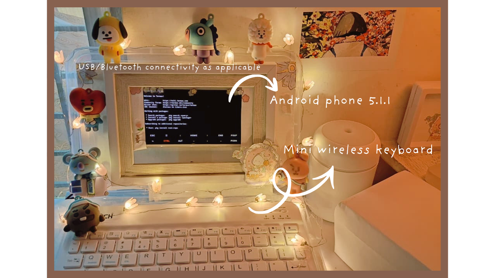

# BT21 Cyberdeck

A portable software engineering platform developed to explore Linux systems, Python development, automation, and mobile-based software engineering using repurposed hardware.

## Hardware

## Objectives

- Design and build a portable development workstation
- Configure a Linux-based development environment
- Develop Python applications
- Implement Git-based version control
- Explore automation and scripting
- Document the engineering process

## Current Capabilities

- Android-based development platform
- Linux terminal (Termux)
- Python 3.8
- Git
- Shell environment

## Technology Stack

- Android
- Linux (Termux)
- Python
- Git
- Shell

## License

MIT
